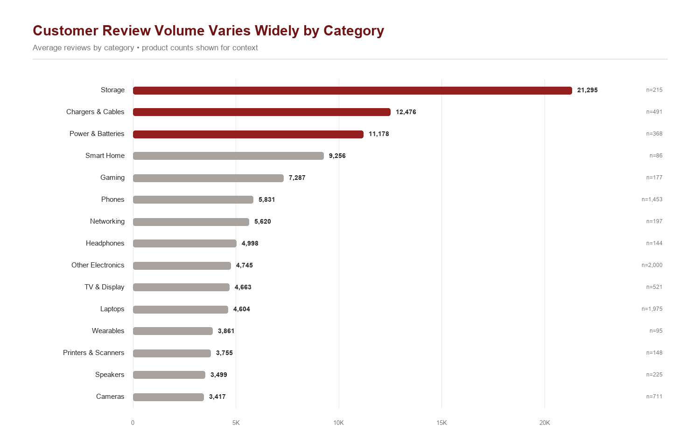

<p align="center">
  
</p>

# NorthPeak Marketplace Growth Strategy Analysis

**Business Analyst | Consumer Insights | Python and Tableau**

[View the interactive Tableau dashboard](https://public.tableau.com/app/profile/oyinlayomi.onafuye/viz/AmazonPricingReviewAnalysis/Dashboard1)

---

## Business Context

NorthPeak is a global consumer products company that designs and distributes home, kitchen, and lifestyle products through major retail partners and online marketplaces across North America.

To support marketplace growth, the Consumer Insights team analyzed publicly available Amazon electronics marketplace data to evaluate customer engagement patterns, pricing dynamics, and competitive positioning across product categories. The goal is to identify where marketplace investments are most likely to improve long-term business performance.

## Business Decision

Should NorthPeak prioritize price-based competition, or invest in initiatives that strengthen customer engagement while preserving long-term profitability?

---

## Executive Summary

NorthPeak wanted to understand whether lower prices are associated with stronger marketplace performance.

Analysis of **42,675 Amazon marketplace observations**, consolidated into **8,806 product records**, found that lower-priced products generated substantially more customer engagement, while average customer ratings remained relatively similar across price tiers.

These findings suggest NorthPeak should test customer-engagement initiatives before relying on broad, permanent price reductions.

Ratings vary little across the five standardized price tiers. Products priced below $25 average 4.53 stars, while products priced from $500 to $1,999 average 4.38 stars. Across all five tiers, including the smaller $2,000+ segment, the rating range is approximately 0.16 stars.

Customer engagement differs much more sharply. Products below $25 average 13,703 reviews, compared with 464 for the $500–1,999 tier—**approximately 30x, or 29.5x, more reviews**. Recent-purchase badges show a similar descriptive pattern: 3,264 average monthly purchases for products below $25 versus 251 for the $500–1,999 tier.

Products with more reviews also **tend to have slightly higher ratings**. This is a descriptive association: review volume may reflect product age, brand awareness, category, availability, and other factors not captured in the dataset.

**Recommendation:** NorthPeak should not assume that permanent price cuts will improve customer ratings. It should test compliant review-generation and purchase-activation initiatives while monitoring conversion, margin, review velocity, and customer experience.

| Metric | Finding |
|---|---:|
| Raw marketplace observations | 42,675 |
| Deduplicated product records | 8,806 |
| Categories | 15 |
| Average review difference: `<$25` vs. `$500–1,999` | 29.5x |
| Rating range across five price tiers | Approximately 0.16 stars |
| Recent-purchase difference: `<$25` vs. `$500–1,999` | Approximately 13x |

---

## Executive Dashboard


The dashboard distinguishes three related but different concepts:

- **Ratings** are observed customer scores.
- **Trust** is an interpretation that may be influenced by visible ratings and reviews but is not directly measured.
- **Customer engagement** is represented by review volume and Amazon recent-purchase badges.

---

## Insights Deep Dive

### 1. Pricing and Ratings

**Question:** Are higher-priced products rated materially better?

No meaningful rating difference appears across the standardized price tiers:

| Price tier | Products | Average rating | Average reviews |
|---|---:|---:|---:|
| `<$25` | 1,940 | 4.53 | 13,703 |
| `$25–99` | 2,856 | 4.46 | 5,964 |
| `$100–499` | 2,812 | 4.38 | 2,223 |
| `$500–1,999` | 673 | 4.38 | 464 |
| `$2,000+` | 101 | 4.51 | 177 |


**Business interpretation:** Price is not a strong indicator of the rating a listing receives. This does not mean price is unimportant to conversion, revenue, or margin—those measures are not included in the dataset.

### 2. Review Volume and Ratings

**Question:** Is review volume associated with customer ratings?

Products in higher review tiers tend to have slightly higher average ratings. The difference between the lowest and highest review tiers is approximately 0.26 stars, but the product-level relationship is weak and should not be interpreted as causal.


**Business interpretation:** Review volume is associated with customer engagement and may contribute to inferred credibility, but the analysis does not establish that reviews cause higher ratings or purchases.

### 3. Category Context

Average review volume varies substantially across electronics categories. Storage, Chargers & Cables, and Power & Batteries have the highest category averages in this snapshot. This ranking describes category context; it does not identify causal exceptions to the overall price relationship.



**Business interpretation:** Category conditions should be considered before applying one marketplace strategy across the entire portfolio. A category-level average alone does not explain why a category has more reviews.

### 4. Marketplace Strategy

The findings support a focused testing agenda:

1. Avoid using permanent discounting as a way to improve customer ratings.
2. Test compliant post-purchase communication, sampling, and customer-experience initiatives intended to encourage authentic reviews.
3. Track review velocity and purchase activity alongside conversion, advertising spend, margin, and return rates.
4. Evaluate results by category rather than assuming the same relationship everywhere.

The data does not establish a universal review threshold or prove that raising prices after accumulating reviews will preserve demand.

---

## Recommendations

### Recommendation 1: Prioritize customer-engagement tests before broad price reductions

**Action:** Test compliant customer-experience and post-purchase initiatives before committing to permanent price reductions.

**Evidence:** Lower-priced products show substantially higher review and recent-purchase activity, while ratings remain relatively similar across price tiers.

**Decision benefit:** NorthPeak can evaluate engagement outcomes without making an immediate, long-term margin commitment.

### Recommendation 2: Evaluate performance and strategy by category

**Action:** Review price, rating, review volume, and recent-purchase activity within each product category.

**Evidence:** Average review volume varies substantially across the 15 electronics categories in the dataset.

**Decision benefit:** NorthPeak can avoid applying one pricing or engagement strategy across categories with different customer behaviors.

### Recommendation 3: Track customer engagement alongside commercial outcomes

**Action:** Monitor review velocity and recent-purchase activity alongside conversion, margin, advertising spend, and returns.

**Evidence:** The public marketplace dataset describes customer engagement but does not include NorthPeak’s internal commercial outcomes.

**Decision benefit:** NorthPeak can assess whether engagement gains translate into profitable business performance.

---

## Expected Business Impact

| Recommendation | Expected decision benefit |
|---|---|
| Test review- and experience-led initiatives | Evaluate marketplace credibility without committing to permanent margin reduction |
| Use pricing selectively | Preserve flexibility while measuring conversion and profitability |
| Review performance by category | Avoid applying a single strategy to materially different markets |
| Track review velocity with commercial KPIs | Connect customer engagement to business outcomes |

---

## Data and Method

**Data Source:** This analysis uses a publicly available Amazon electronics marketplace dataset as a source of competitive marketplace intelligence. The dataset is used to demonstrate how publicly available marketplace data can support pricing, customer engagement, and marketplace growth decisions.

**Raw data:** 42,675 listing observations collected from August 21–30, 2025.

**Final data:** 8,806 deduplicated product records across 15 categories.

**Deduplication:** The latest observation was retained for each extractable ASIN. Listings without a usable ASIN used title, rating, and review count as a fallback, followed by a final cross-group title check.

**Standardized price tiers:**

- `<$25`
- `$25–99`
- `$100–499`
- `$500–1,999`
- `$2,000+`

**Tools:** Python and pandas for cleaning and analysis, and Tableau for interactive visualization.

---

## Limitations

- Findings are **descriptive associations and do not establish causation**.
- Amazon listings are used as a proxy for marketplace conditions; internal conversion, revenue, margin, advertising, and return data were unavailable.
- Ratings are observed, trust is inferred, and review and recent-purchase volume represent customer engagement.
- The dataset covers electronics; findings may not transfer directly to home, kitchen, or lifestyle products.
- Review, price, and purchase distributions are right-skewed, so averages can be influenced by high-volume products.
- Recent-purchase badges are threshold-style marketplace labels rather than exact transaction records.
- Approximately 17% of raw rows contained non-null scraping artifacts in the purchase field and were treated as missing during parsing.
- The data is a snapshot and does not track product performance or pricing changes over time.

---

## Repository

```text
.
├── README.md
├── amazon_products_sales_data_uncleaned.csv
├── amazon_FINAL.csv
├── amazon_project.py
├── marketplace_analysis.py
├── TABLEAU_PUBLIC_CHECKLIST.md
├── chart_data/
│   ├── category_summary.csv
│   ├── price_tier_summary.csv
│   └── review_tier_summary.csv
├── Dashboard 1.png
├── Price vs Volume Quality.png
├── Review Tier vs Avg Rating.png
├── Category.png
├── .gitignore
```

### Run locally

From the repository root:

```bash
python amazon_project.py
python marketplace_analysis.py
```

`amazon_project.py` reports the raw-to-final cleaning audit without overwriting the curated dataset. `marketplace_analysis.py` reproduces the summary tables and static portfolio visuals from `amazon_FINAL.csv`.

---

## Key Takeaways

- Lower-priced products show substantially higher review and recent-purchase activity.
- Average customer ratings remain relatively similar across price tiers.
- Products with more reviews tend to have slightly higher ratings, although the relationship is weak and descriptive.
- NorthPeak should test customer-engagement initiatives while protecting margin and measuring commercial outcomes.

---

## Skills Demonstrated

- Translating a marketplace question into measurable analytical comparisons
- Cleaning malformed scraped data with Python and Pandas
- Deduplicating repeated product observations with ASINs
- Aggregating product data for business analysis
- Building an executive Tableau dashboard
- Distinguishing measured outcomes from business interpretation
- Communicating findings, limitations, and recommended next steps
